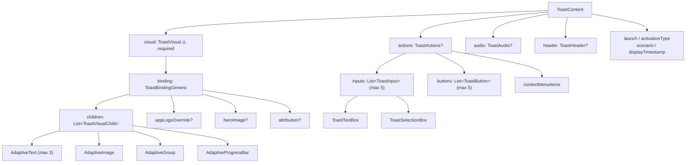

# Notification (Windows)

Complete Kotlin mapping of the [Windows Toast Notifications API](https://learn.microsoft.com/en-us/windows/apps/develop/notifications/app-notifications/) via JNI. Show rich toast notifications with text, images, buttons, text input, selection boxes, progress bars, headers, and audio on Windows 10/11.

!!! info "WinRT via WRL"
    Uses Microsoft WRL (Windows Runtime Library) for COM event handling — no JNA, no reflection. Supports both MSIX-packaged and unpackaged apps.

## Installation

```kotlin
dependencies {
    implementation("io.github.kdroidfilter:nucleus.notification-windows:<version>")
}
```

Depends on `core-runtime` (compile-only) for `NativeLibraryLoader`, `ExecutableRuntime`, and `NucleusApp`.

## Quick Start

```kotlin
import io.github.kdroidfilter.nucleus.notification.windows.*

// 1. Initialize (auto-detects APPX vs unpackaged)
WindowsNotificationCenter.initialize()

// 2. Show a simple toast
WindowsNotificationCenter.showSimple(
    title = "Hello!",
    body = "Welcome to Nucleus.",
    tag = "greeting",
)
```

!!! tip "AUMID handling"
    - **APPX/MSIX**: the AUMID is resolved automatically from the package identity.
    - **Unpackaged apps (EXE, MSI, dev)**: the library derives the AUMID from `NucleusApp.appId` and registers it on the process via `SetCurrentProcessExplicitAppUserModelID`.
    - You can also pass an explicit AUMID: `initialize(aumid = "MyCompany.MyApp")`.

!!! warning "Installed app required"
    Notifications on unpackaged apps require a Start Menu shortcut (`.lnk`) with the AUMID property set. Without it, toasts may not appear or persist in Action Center.

    This shortcut is created by the installer (e.g. `./gradlew packageDistributionForCurrentOS`). When running via `./gradlew run`, notifications will work **only if the app has been installed before** (even a different version), since the shortcut already exists.

    This is similar to macOS, where notifications require a packaged `.app` bundle.

## API Reference

### `WindowsNotificationCenter`

Main entry point. All methods are thread-safe.

| Property / Method | Description |
|---|---|
| `isAvailable: Boolean` | `true` if native library loaded (Windows only) |

#### Initialization

| Method | Returns | Description |
|---|---|---|
| `initialize(aumid?)` | `Boolean` | Initialize the notification subsystem. Pass `null` (default) to auto-resolve the AUMID. |
| `uninitialize()` | `Unit` | Clean up native resources. Call on app shutdown. |

#### Showing Notifications

| Method | Description |
|---|---|
| `show(content, tag, group, ...)` | Show a toast from a `ToastContent` model. Supports `initialData` for data-bound progress bars. |
| `showSimple(title, body, body2, tag, group)` | Show a simple text-only toast (up to 3 lines). |
| `showFromXml(xml, tag, group, ...)` | Show a toast from raw XML string. |

#### Updating & Removing

| Method | Description |
|---|---|
| `update(tag, group, data)` | Update data-bound fields (progress bars) without replacing the toast. |
| `remove(tag, group)` | Remove a specific toast from Action Center. |
| `removeGroup(group)` | Remove all toasts in a group. |
| `clearAll()` | Remove all toasts for this app. |

#### History & Listeners

| Method | Description |
|---|---|
| `getHistory(callback)` | Get active notifications. Callback: `(List<HistoryEntry>, String?) -> Unit` |
| `addListener(listener)` | Register a `ToastNotificationListener` for lifecycle events. |
| `removeListener(listener)` | Unregister a listener. |

---

### `ToastNotificationListener`

Implement this interface to receive toast lifecycle events. All callbacks are dispatched on the Swing EDT.

| Method | Description |
|---|---|
| `onActivated(tag, group, arguments, userInputs)` | User clicked the toast body or a button. `userInputs` contains text box / selection values. |
| `onDismissed(tag, group, reason)` | Toast was dismissed (`USER_CANCELED`, `APPLICATION_HIDDEN`, `TIMED_OUT`). |
| `onFailed(tag, group, errorCode)` | Toast failed to display (HRESULT error code). |

---

## Toast Content Model

The `ToastContent` data class maps the full [toast XML schema](https://learn.microsoft.com/en-us/windows/apps/develop/notifications/app-notifications/toast-schema):



### Data Types

#### Visual Elements

| Type | Description |
|---|---|
| `AdaptiveText` | Text element. Properties: `text`, `hintStyle`, `hintWrap`, `hintMaxLines`, `hintMinLines`, `hintAlign`, `language` |
| `AdaptiveImage` | Inline image. Properties: `source`, `hintCrop`, `hintRemoveMargin`, `hintAlign`, `alternateText`, `addImageQuery` |
| `ToastGenericAppLogo` | App logo override (left of text). Properties: `source`, `hintCrop`, `alternateText` |
| `ToastGenericHeroImage` | Large hero image at top of toast. Properties: `source`, `alternateText` |
| `ToastGenericAttributionText` | Attribution text at bottom. Properties: `text`, `language` |

#### Adaptive Layout

| Type | Description |
|---|---|
| `AdaptiveGroup` | Multi-column layout container. Contains `List<AdaptiveSubgroup>`. |
| `AdaptiveSubgroup` | Column within a group. Properties: `children`, `hintWeight`, `hintTextStacking` |

#### Progress Bar

| Type | Description |
|---|---|
| `AdaptiveProgressBar` | Progress bar with data binding support. Properties: `title`, `value` (0.0-1.0), `valueBind` (binding key), `valueStringOverride`, `status` |

Use `valueBind` and `{key}` syntax in string fields for live updates via `WindowsNotificationCenter.update()`.

#### Inputs

| Type | Description |
|---|---|
| `ToastTextBox` | Text input. Properties: `id`, `title`, `placeholderContent`, `defaultInput` |
| `ToastSelectionBox` | Dropdown. Properties: `id`, `title`, `defaultSelectionBoxItemId`, `items: List<ToastSelectionBoxItem>` |
| `ToastSelectionBoxItem` | Selection item. Properties: `id`, `content` |

#### Buttons

| Type | Description |
|---|---|
| `ToastButton` | Action button. Properties: `content`, `arguments`, `activationType`, `imageUri`, `inputId`, `afterActivationBehavior`, `tooltipText` |
| `ToastButtonSnooze` | System snooze button. Properties: `customContent`, `selectionBoxId` |
| `ToastButtonDismiss` | System dismiss button. Properties: `customContent` |
| `ToastContextMenuItem` | Right-click context menu item. Properties: `content`, `arguments`, `activationType` |

#### Audio

| Type | Description |
|---|---|
| `ToastAudio` | Sound configuration. Properties: `source` (use `ToastAudioSource`), `customSource`, `loop`, `silent` |

#### Header

| Type | Description |
|---|---|
| `ToastHeader` | Groups notifications in Action Center. Properties: `id`, `title`, `arguments`, `activationType` |

#### Data Binding

| Type | Description |
|---|---|
| `ToastNotificationData` | Data for updating bound fields. Properties: `sequenceNumber`, `values: Map<String, String>` |

### Enums

| Enum | Values |
|---|---|
| `ActivationType` | `FOREGROUND`, `BACKGROUND`, `PROTOCOL` |
| `AfterActivationBehavior` | `DEFAULT`, `PENDING_UPDATE` |
| `ToastScenario` | `DEFAULT`, `REMINDER`, `ALARM`, `INCOMING_CALL` |
| `DismissalReason` | `USER_CANCELED`, `APPLICATION_HIDDEN`, `TIMED_OUT` |
| `AdaptiveTextStyle` | 17 styles: `CAPTION`, `BODY`, `BASE`, `SUBTITLE`, `TITLE`, `SUBHEADER`, `HEADER` + subtle/numeral variants |
| `AdaptiveTextAlign` | `DEFAULT`, `AUTO`, `LEFT`, `CENTER`, `RIGHT` |
| `AdaptiveImageCrop` | `DEFAULT`, `NONE`, `CIRCLE` |
| `AdaptiveImageAlign` | `DEFAULT`, `STRETCH`, `LEFT`, `CENTER`, `RIGHT` |
| `ImagePlacement` | `INLINE`, `APP_LOGO_OVERRIDE`, `HERO` |
| `AdaptiveSubgroupTextStacking` | `DEFAULT`, `TOP`, `CENTER`, `BOTTOM` |
| `ToastAudioSource` | 25 sounds: `DEFAULT`, `IM`, `MAIL`, `REMINDER`, `SMS`, `ALARM_DEFAULT`-`ALARM10`, `CALL_DEFAULT`-`CALL10` |

---

## Kotlin DSL

A type-safe DSL builder is provided for convenient toast construction:

```kotlin
val content = toast {
    launch = "action=viewMessage&id=123"
    scenario = ToastScenario.REMINDER

    visual {
        text("Meeting Reminder")
        text("Team standup in 5 minutes")
        heroImage("https://example.com/hero.png")
        appLogo("https://example.com/logo.png", crop = AdaptiveImageCrop.CIRCLE)
        attribution("via Calendar")

        progressBar(
            status = "{progressStatus}",
            title = "{progressTitle}",
            valueBind = "progressValue",
        )

        group {
            subgroup(weight = 1) {
                text("Column 1", style = AdaptiveTextStyle.CAPTION)
            }
            subgroup(weight = 2) {
                text("Column 2", style = AdaptiveTextStyle.BODY)
            }
        }
    }

    actions {
        textBox("replyBox", title = "Reply", placeholder = "Type a message...")
        selectionBox("snoozeTime", title = "Snooze for") {
            item("5", "5 minutes")
            item("15", "15 minutes")
            item("60", "1 hour")
        }
        button("Reply", arguments = "action=reply", inputId = "replyBox")
        button("Dismiss", arguments = "action=dismiss",
            activationType = ActivationType.BACKGROUND)
        contextMenuItem("Open settings", arguments = "action=settings")
    }

    audio(ToastAudioSource.REMINDER)
    header(id = "meetings", title = "Meetings", arguments = "action=openMeetings")
}

WindowsNotificationCenter.show(content, tag = "meeting-1")
```

## Progress Bar with Data Binding

To update a progress bar live without replacing the toast:

```kotlin
// 1. Show toast with bindable progress bar
val content = toast {
    visual {
        text("Downloading file.zip")
        progressBar(
            title = "{title}",
            valueBind = "progressValue",
            valueStringOverride = "{progressOverride}",
            status = "{status}",
        )
    }
}

WindowsNotificationCenter.show(
    content,
    tag = "download-1",
    initialData = ToastNotificationData(
        sequenceNumber = 0,
        values = mapOf(
            "title" to "file.zip",
            "progressValue" to "0",
            "progressOverride" to "0%",
            "status" to "Starting...",
        ),
    ),
)

// 2. Update the progress
WindowsNotificationCenter.update(
    tag = "download-1",
    data = ToastNotificationData(
        sequenceNumber = 1,
        values = mapOf(
            "title" to "file.zip",
            "progressValue" to "0.75",
            "progressOverride" to "75%",
            "status" to "Downloading...",
        ),
    ),
)
```

!!! warning "Data binding requirements"
    - The toast **must** have a `tag` (required for `update` to find the notification).
    - Use `{key}` syntax in string fields and `valueBind` for the progress value.
    - The initial toast **must** include `initialData` with all binding keys set.
    - Each `update` call must increment `sequenceNumber` to avoid race conditions.

## Handling User Input

When a toast has input elements (text boxes, selection boxes), the user's input is delivered in the `onActivated` callback:

```kotlin
WindowsNotificationCenter.addListener(object : ToastNotificationListener {
    override fun onActivated(
        tag: String,
        group: String,
        arguments: String,
        userInputs: Map<String, String>,
    ) {
        // arguments = "action=reply"
        // userInputs = {"replyBox" to "Hello!"}
        println("Reply text: ${userInputs["replyBox"]}")
    }

    override fun onDismissed(tag: String, group: String, reason: DismissalReason) {}
    override fun onFailed(tag: String, group: String, errorCode: Int) {}
})
```

## Constraints

| Constraint | Limit |
|---|---|
| Top-level text elements | 3 max |
| Input elements per toast | 5 max |
| Buttons per toast | 5 max (shared with context menu items) |
| Toast XML payload | 5 KB max |
| Image size | 3 MB (1 MB on metered connections) |
| Notifications per app in Action Center | 20 max |
| Tag / Group length | 16 characters max |

## Native Library

Ships pre-built Windows DLLs (x64 + ARM64). No macOS or Linux native — `isAvailable` returns `false` on other platforms and all methods are no-op.

- `nucleus_notification_windows.dll` — linked against `ole32`, `runtimeobject`, `shell32`, `user32`, `advapi32`
- Requires Windows 10 (build 10240+)
- Headers and progress bars require Creators Update (build 15063+)
- Uses WRL `Callback<>` for COM event handlers

## ProGuard

```proguard
-keep class io.github.kdroidfilter.nucleus.notification.windows.NativeWindowsNotificationBridge {
    native <methods>;
    static ** on*(...);
}
```

## GraalVM

Reachability metadata is included in the JAR at `META-INF/native-image/io.github.kdroidfilter/nucleus.notification-windows/reachability-metadata.json`. No additional configuration needed.
